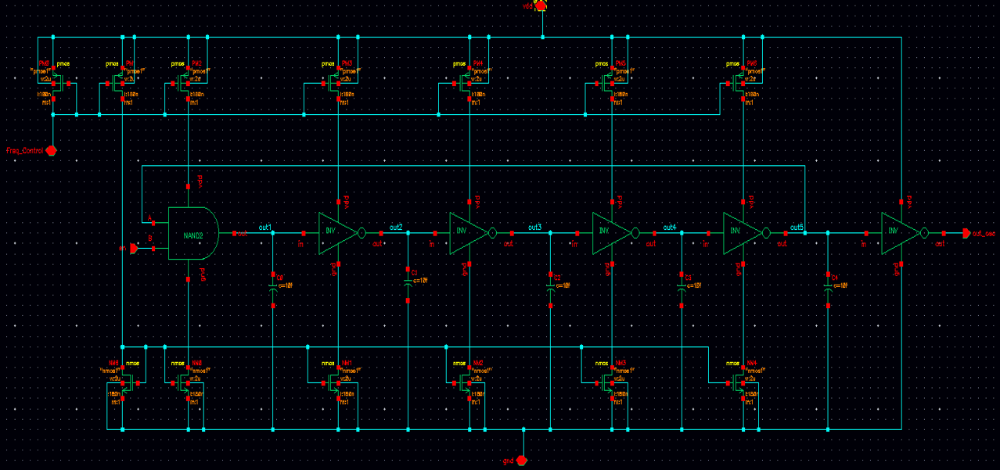
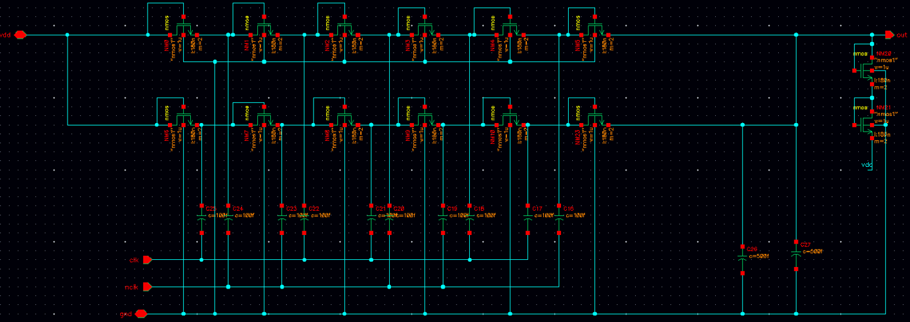
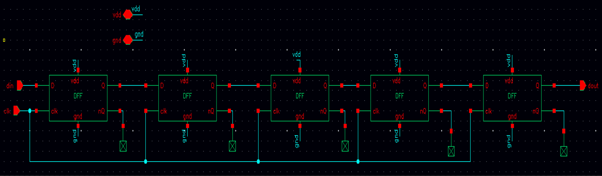
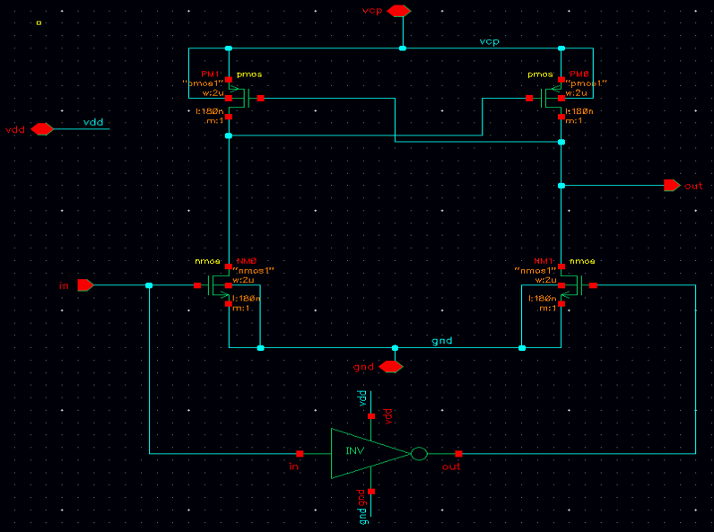

# CMOS-High-Side-Gate-Driver
CMOS high-side gate driver designed in Cadence Virtuoso as part of a university team project, including block-level design, simulation, and top-level validation.

## Example Block Schematics

### Ring Oscillator

### Charge Pump

### Delay Circuit

### Level Shifter

