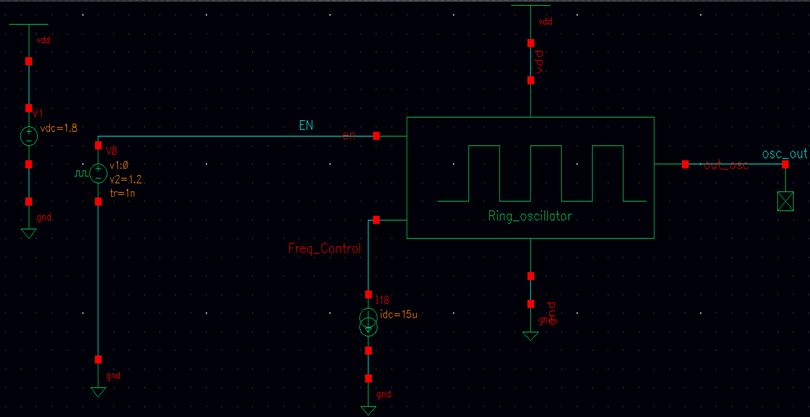
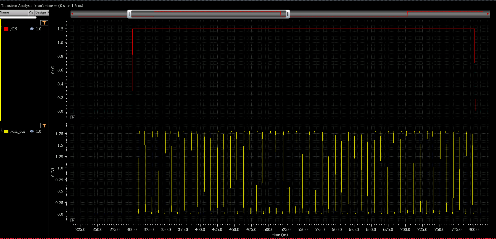
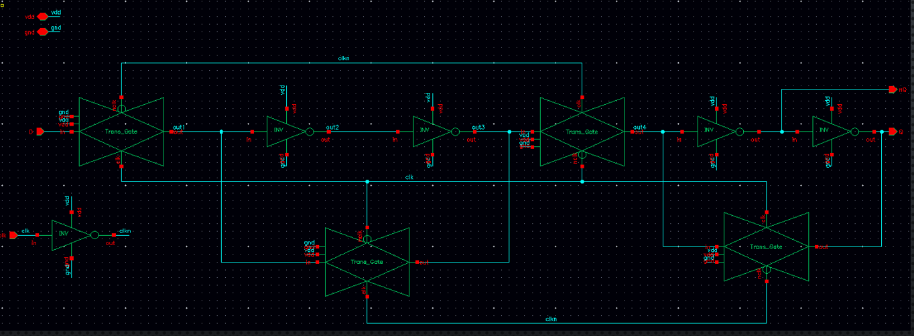
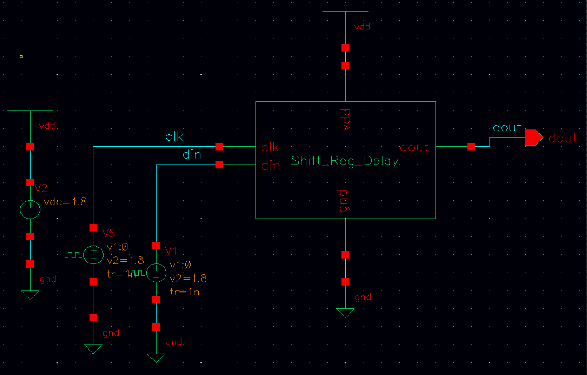
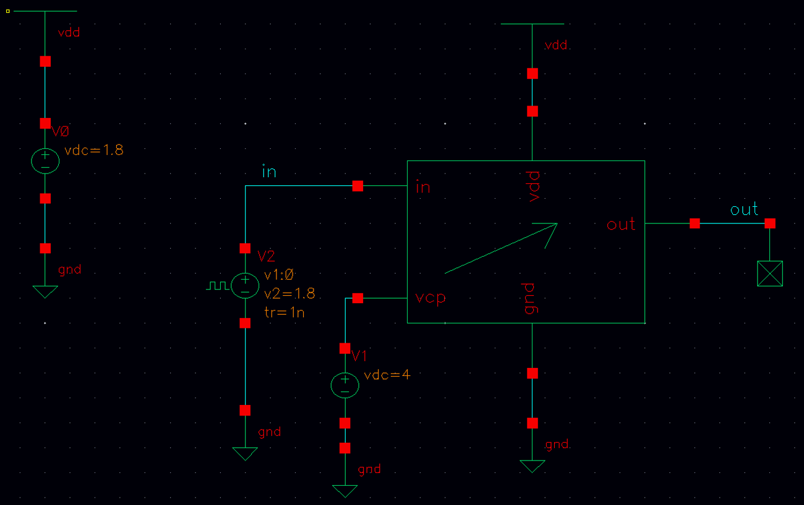
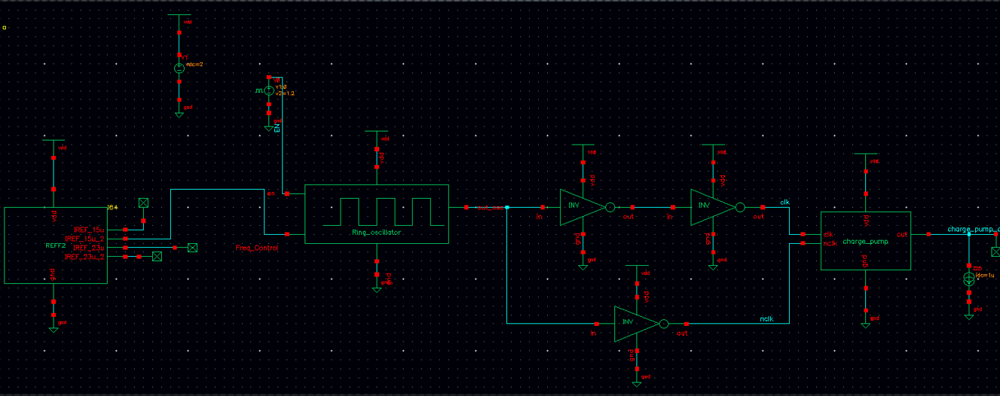
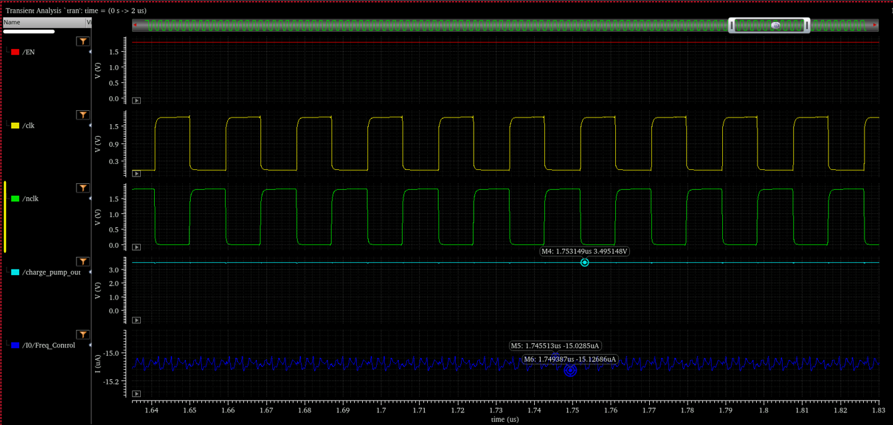
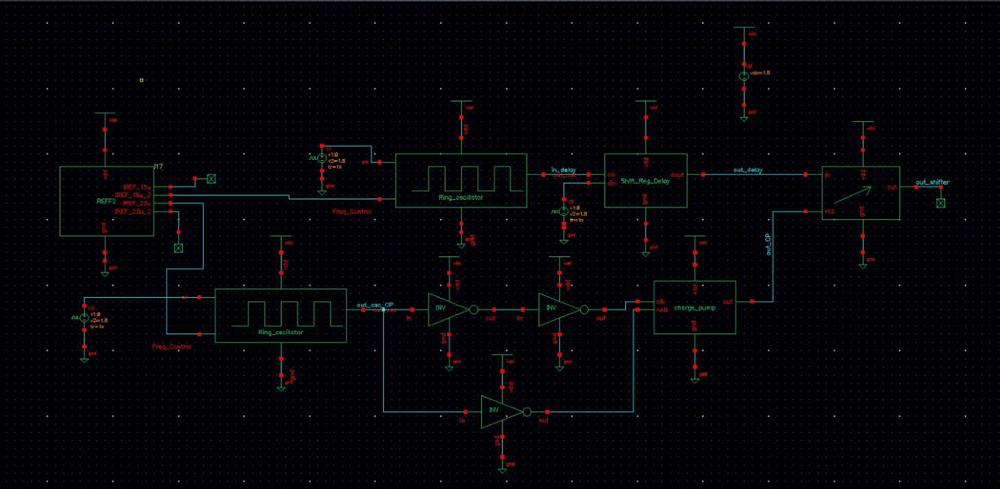
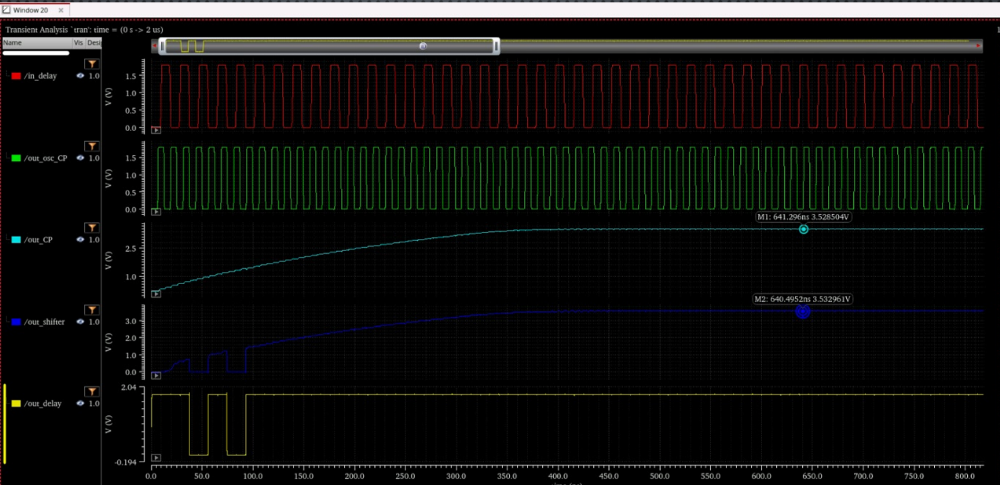
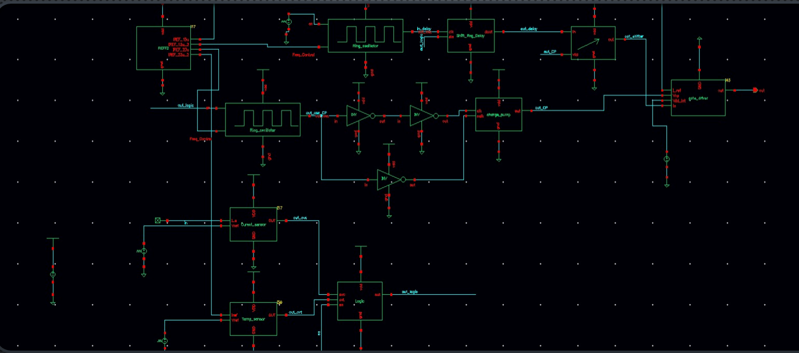

# CMOS High-Side Gate Driver for Power NMOS Control

Project developed as part of the **BTM course**  
**University POLITEHNICA of Bucharest – Faculty of Electronics, Telecommunications and Information Technology**

## Overview

This repository documents the design, simulation, and validation of a **CMOS high-side gate driver** intended to control a power NMOS transistor from a low-voltage logic input. The project was developed in an academic team setting, following the specification of a simplified high-side driver architecture that includes signal generation, voltage boosting, delay control, level shifting, and final gate-driving functionality.

The design was implemented and validated at **transistor level in Cadence Virtuoso**, with emphasis on block-level correctness, signal compatibility between stages, and integrated functional verification.

## Project Context

The project started from a provided design brief for a **simplified high-side driver**, together with course and reference materials related to smart power circuits, high-side drivers, charge pumps, and supporting analog blocks.  
Therefore, some blocks were **developed based on project documentation and technical references**, then adapted, implemented, simulated, and integrated as part of the final design flow.

This approach reflects standard engineering practice: the goal was not to invent each block from scratch, but to understand the required architecture, implement the relevant subcircuits, validate them, and integrate them into a working system.

## Design Targets

The project followed the specifications assigned to **Team 5**, including:

- **Turn-on time (Ton): 10 µs**
- **Turn-off time (Toff): 5 µs**
- **Maximum ON resistance target (Ron): 250 Ω**
- **Minimum charge pump output: Vcp ≥ Vdd + 2Vth**
- **Vdd operating range: 2 V to 4 V**
- **Internal supply: Vdd_int = 1.8 V**

These constraints defined the expected behavior of the driver chain and guided the validation of the key functional blocks.

## System Architecture

The complete project architecture includes the following major blocks:

- Current Reference
- Ring Oscillator
- Charge Pump
- D Flip-Flop
- Delay Circuit
- Level Shifter
- Gate Driver
- Logic and protection-related support blocks
- Temperature and current sensing support blocks

At signal-path level, the most relevant validated chain was:

**Enable / reference-controlled signal path → Ring Oscillator → Inverters / clock shaping → Charge Pump → Delay Circuit → Level Shifter → Gate Driver**

In the early design phase, the first integrated subsystem combined:

- **Current Reference** (support block, not my main design responsibility)
- **Ring Oscillator**
- **Charge Pump**
- **Intermediate inverters / clock conditioning**

This initial integration stage was used to verify clock generation and charge-pump operation before moving to the broader system-level validation.

## My Contribution

Although the project was developed in a **team context**, my contribution covered the main design and validation effort for several key control-path blocks.

### Main responsibilities
- **Ring Oscillator**
- **D Flip-Flop**
- **Transmission Gate**
- **Delay-related implementation**
- **Charge Pump**
- **Level Shifter**
- **Top-level integration and validation support**

### Work performed
- transistor-level schematic design;
- block-level simulation and functional verification;
- validation of waveform behavior and signal propagation;
- support for integration between the designed blocks;
- verification of the combined operation of the oscillator, charge pump, delay circuit, and level shifter;
- contribution to the final integrated system validation.

## Functional Block Description

---

## 1. Ring Oscillator

The ring oscillator provides the clock signal required by the charge pump.  
It was implemented as a **current-controlled ring oscillator**, using an odd number of inverter stages connected in a loop, together with an enable function and frequency control through bias current.

The role of this block is essential because the charge pump requires a periodic clock signal in order to transfer charge across its stages and generate the boosted output voltage.

### Design considerations
The oscillator was designed to:
- start only when the enable signal is active;
- generate a stable rectangular waveform;
- allow frequency control through the bias/current path;
- provide a usable clock signal for the following stages.

### Validation
The oscillator was tested using:
- **1.8 V supply conditions**
- enable activation
- current-based frequency control

The transient response confirmed correct startup behavior and stable oscillation after enable activation. Based on the simulation waveform, the oscillation frequency is approximately in the **tens of MHz range** (roughly around **50 MHz**, estimated visually from the transient plot).

### Ring Oscillator – Schematic


### Ring Oscillator – Testbench


### Ring Oscillator – Output Waveform


---

## 2. Charge Pump

The charge pump is responsible for generating a voltage higher than the available supply, which is required for controlling the gate of the high-side power NMOS transistor.

In this project, the charge pump was implemented as a **5-stage NMOS diode-connected topology**, driven by two clock phases in antiphase. Its purpose was to generate a boosted output voltage capable of meeting the target condition:

**Vcp ≥ Vdd + 2Vth**

### Why this block is needed
Because the power device is an NMOS used in a high-side configuration, the gate must be driven above the source potential in order to turn the transistor on properly. A normal low-voltage logic signal is not sufficient, so a charge pump is required to create the elevated control voltage.

### Design considerations
During design and validation, attention was given to:
- progressive voltage boosting across the pump stages;
- compatibility with the oscillator-generated clock;
- proper charge transfer between stages;
- output stabilization and useful boosted voltage level.

### Validation
The charge pump was tested both:
- together with the ring oscillator;
- with the support of the current reference path;
- in integrated simulations with the downstream blocks.

The integrated transient results show the charge pump output rising progressively and stabilizing around **3.5 V**, which confirms correct boosting behavior starting from low-voltage supply conditions.

### Charge Pump – Schematic


---

## 3. D Flip-Flop

The D flip-flop was implemented at transistor level and used as the basic storage element for the delay path.

It updates its output on the active clock transition and preserves the stored state while the clock is inactive. This behavior makes it suitable for controlled signal propagation through multiple clock periods.

### Internal implementation
The DFF was built using **transmission gates and inverters**, forming a clock-controlled storage structure. This is relevant because it shows the transistor-level implementation rather than only the abstract logic symbol.

### Why this block matters
The D flip-flop is the fundamental building block of the delay chain. A correct DFF implementation is critical for predictable timing, correct signal transfer, and reliable sequential behavior.

### D Flip-Flop – Internal Schematic


---

## 4. Delay Circuit

The delay circuit was implemented as a **shift-register-based delay block**, using **5 D flip-flops connected in series**.

Its role is to introduce a controlled delay between the input signal and the output signal, which is useful when signal timing must be aligned with the behavior of the other blocks in the gate-driver chain.

### Why this block is needed
In a multi-stage control path, not all signals should necessarily propagate immediately. The delay block helps shape the temporal relationship between control signals and the charge-pump / level-shifting path.

### Design considerations
The main objective was to obtain:
- predictable clocked propagation;
- controlled delay across multiple clock periods;
- compatibility with the oscillator-generated clock signal.

Because the delay chain consists of **5 cascaded DFF stages**, the output is delayed by approximately **5 clock periods** relative to the input sequence.

### Delay Circuit – Schematic


### Delay Circuit – Testbench


---

## 5. Level Shifter

The level shifter converts a low-voltage logic signal into a signal compatible with the higher-voltage domain used by the gate-driving path.

This block is necessary because the control logic operates at low voltage, while the gate-driving section must work with the boosted voltage generated by the charge pump.

### Why this block is needed
Without level shifting, the low-voltage logic signal would not be sufficient to properly control the gate driver and, ultimately, the power NMOS transistor.

### Design considerations
The level shifter was designed and verified to:
- accept a low-voltage logic input;
- operate correctly with the boosted voltage domain;
- propagate the signal without losing compatibility with the downstream stage.

### Validation
The level shifter was validated:
- as an individual block;
- together with the charge pump;
- together with the delay circuit;
- in the integrated driver chain.

The integrated waveform shows that the level-shifted output reaches approximately the same boosted domain as the charge-pump output, around **3.5 V**, which confirms correct signal translation toward the high-voltage control path.

### Level Shifter – Schematic


### Level Shifter – Testbench


---

## Initial Integration Stage

In the first relevant integration stage, the following blocks were connected and tested together:

- Current Reference
- Ring Oscillator
- Clock-shaping inverters
- Charge Pump

This stage was useful to confirm that:
- the oscillator starts correctly;
- the generated clock can be conditioned and propagated further;
- the charge pump receives the expected clock activity;
- the boosted output begins rising as intended.

### Initial Integration – Schematic


### Initial Integration – Waveforms


---

## Integrated Validation

Beyond individual block simulations, the project also included **integrated verification**, where multiple designed blocks were tested together to ensure correct system-level interaction.

### Integrated chain
The integrated validation included the combined operation of:
- ring oscillator;
- charge pump;
- delay circuit;
- level shifter;
- support/control connections required for signal propagation.

### What was verified
The purpose of this validation was to confirm:
- correct oscillator startup and clock generation;
- correct propagation of delayed signals;
- correct voltage boosting in the charge pump;
- correct translation of the signal to the boosted voltage domain;
- compatibility between the interconnected blocks.

### Observed results
The integrated transient behavior shows:
- active oscillation at the oscillator output;
- progressive increase of the charge-pump output;
- delayed signal propagation through the delay block;
- level-shifter output reaching the boosted control domain;
- coherent signal transfer across the validated chain.

The integrated plots indicate a charge pump output of approximately **3.50 V**, while the level-shifter output also reaches approximately **3.53 V**, showing that the translated signal follows the boosted domain correctly.

### Integrated Validation – Schematic


### Integrated Validation – Waveforms


---

## Final System Schematic

The figure below shows the broader final integrated system view used at project level.

This schematic represents the **team-level integrated design**, therefore it should be understood as a collective system-level result rather than an individual block-only contribution.

### Final System – Schematic


## Technical Discussion

From an engineering perspective, the project is relevant because it combines several important mixed-signal design concepts in the same signal chain:

- **clock generation** through a current-controlled ring oscillator;
- **voltage boosting** through a multi-stage charge pump;
- **signal timing control** through a shift-register-based delay path;
- **voltage-domain adaptation** through a level shifter;
- **hierarchical integration** of multiple transistor-level blocks.

The design process also highlights an important practical aspect of analog and mixed-signal IC development: blocks are rarely created in isolation and considered “done” immediately. In practice, their real value appears only after:
- individual functional verification;
- compatibility checking with adjacent stages;
- iterative integration into a larger system;
- interpretation of transient simulation results.

## Tools Used

- **Cadence Virtuoso**
- transistor-level schematic design
- transient simulation
- mixed-signal functional verification
- hierarchical block integration

## Repository Structure

```text
├── Images/
├── Presentation/
├── Simulations/
└── README.md
